# Cycling across japan

---
title: cycling across japan
date: 2023-08-27T08:00:00.000Z
published: true
---

Cycling is one of my life-long hobbies, and also my main means of staying in shape. I'm writing this post mostly for my own records but sharing it in a hope that it may be helpful or at very least interesting to some of you.

---

[ハチミツとクローバ (Honey and Clover)](https://en.wikipedia.org/wiki/Honey_and_Clover) is one of my favourite anime series to this day. While watching it (over two decades ago!)  I was quite emotionally attached to the characters and story progression. One specific arc in the story sees a character who has lost his direction in life decide impulsively to cycle as far as he can without looking back.

He ends up cycling a good portion of Japan, and learning much about himself.

I've ever since had a lifelong goal of cycling the whole of Japan. Of course, Japan is a big country – cycling the full length would be over 2,000km!!. I'm no professionally trained cyclist – sure I've done a few 60-80km rides in the past, but doing more than that distance in a day would definitely be pushing it, so that's quite some distance to travel.

With my busy life of maintaining a game played by millions of players while ALSO trying to rewrite that game on the side, such a goal seems unattainable.

Of course you could argue that I could just drop everything for a few months and make it happen. But I suffer from very high self expectations and drive to keep osu! going strong, so that's just not going to happen. But when I was talking to a friend about their upcoming trip to Japan and they mentioned planning a cycling journey across a smaller portion of the country, I jumped on the opportunity to ask whether I could tag along – and luckily they accepted!

So the cogs started turning to plan cycling trip which ended up spanning just shy of 1,000km, but had time allowances in it for both my friend's plans to meet his various Splatoon acquaintances across the country, and my own dev time requirements on a daily basis.

---

# The company

I should probably start by introducing [Dunnymeister](https://twitter.com/Dunnymeister) (shortened Dunny), my good friend (and later on coworker for some time before osu! took off). He's a Taiko no Tatsujin connoisseur, great chef and even [brews](https://twitter.com/Dunnymeister/status/1535441445921751040) his [own beer](https://twitter.com/Dunnymeister/status/1572160175502667776).

# The bikes

In recent times, I've been using an e-bike to get around. But I wasn't about to take an e-bike on such a trip – not only would charging be a hassle (if it made it through a day in the first place), but it would just be rude to be riding an e-bike alongside Dunny on a non-powered bicycle. And honestly it would just make the whole trip less of a challenge.

Dunny originally planned to bring his bike across from Australia with him, but the logistics of this were (and registration requirements in Japan) made him look in the direction of purchasing a bike here instead.

It ended up that we both started looking into Trek bicycles and settled on some mid-range models. Aluminium body with hydraulic brake and drop handles were the criteria we had in mind.

I went with a "gravel" model for thicker tyres. Mostly just from being used to riding on tyres that look like they aren't going to completely lose traction at the sight of some non-road terrain. Dunny went for the road model, which left us with an 8mm difference (32mm vs 40mm). Probably made life slightly harder for me due to lower efficiency, but it didn't end up being the largest problem.

For reference, the models were Trek Checkpoint ALR5 and Trek Domane AL4. They served us well (and will continue to do so into the distant future, no doubt).

## The gear

# The assembly

Dunny had already chosen various cycling routes he wanted to challenge. But these were spread across half the country, and cycling *between* each of the courses would take way too much time. And, well, this was supposed to be a casual sightseeing trip, not a gruelling endurance ride.

So the decision was there from the outset to use trains to get between some of the more distant areas we wanted to. The caveat being that bicycles are not allows on Japanese trains (with [one recent exception!](https://www.jreast.co.jp/multi/en/joyful/bbbase.html)), which means we have to get used to what is known as Rinko (輪行) – the art of disassembling your bike and putting it in a bag with no parts showing.

# The journey

## Shimanami Kaido (しまなみ海道)

Potentially the most famous cycling route in Japan, spanning the islands of Shikoku (四国). This was the start of our journey, although we spent the first day getting roughly to the starting point by train, opting to ride the final leg from the Shinkansen station rather than catching a second local train. After our first train ride we were already tired of carrying our bikes on our shoulders and jumped at the opportunity to skip one train.

We also had a bit of a rough start after discovering our train booking didn't have the oversize baggage area reserved. This surprised me as I was very careful to select the option when booking in the app. It was only later in the trip where I discovered an iOS level UX issue which can cause a change in setting to not register if you perform it too fast:

<video width="100%" controls src="ios-bug.mov"></video>

The train crew handled it so courteously and without any signs of distress, allowing us to put the bikes in between cars. I continue to have unwavering faith in JR as a company. But we did really want to get off the trains and onto the bikes, so jumped off at Fukuyama (福山) station with the starting point of Onomichi (尾道) in our sights.

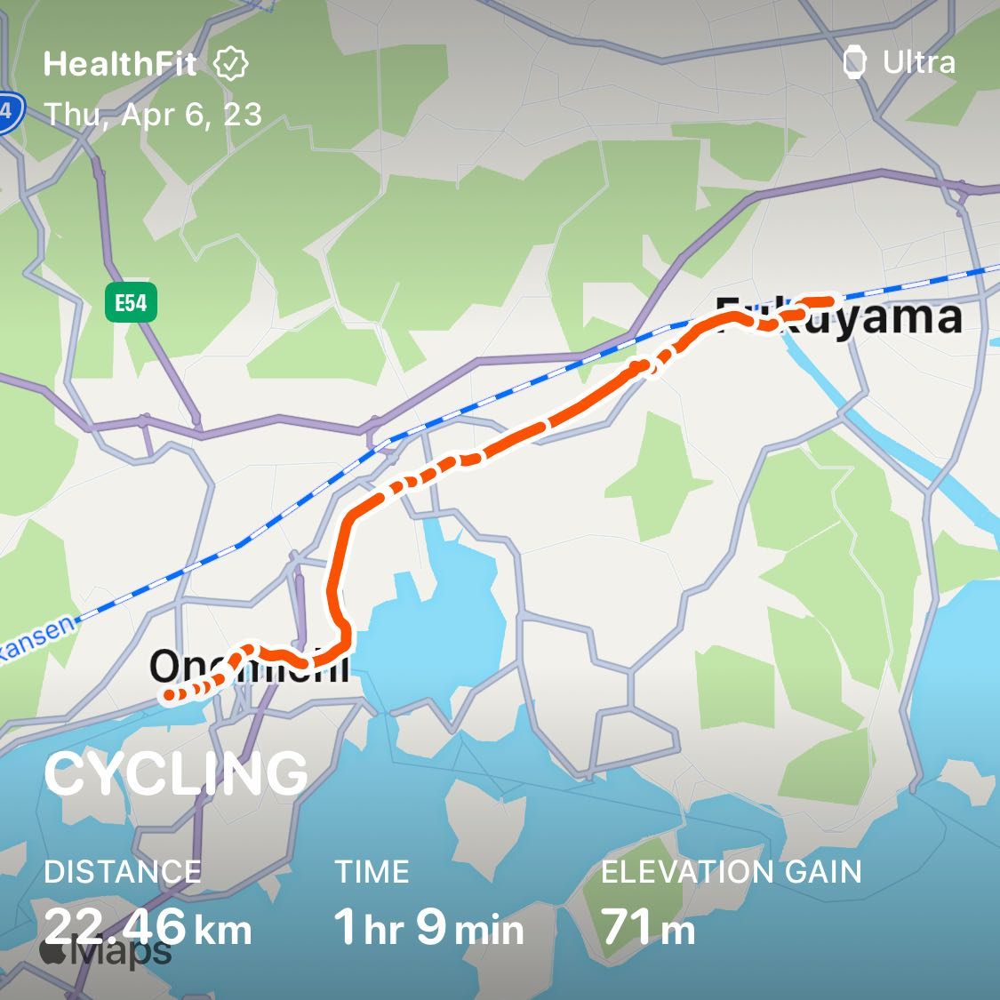

This was the first time we discovered just how much there is to see, even when not planning around destinations. Even as we were racing an incoming storm, we couldn't help but stop to take in the sakura in full-blossom; an amazing temple; a small corner shop selling the local range of citrus fruits and as we approached our destination, taking in the scenery of the nearby river.

Onomichi was a very cyclist friendly place to be, with the hotel we chose having dedicated road bike parking and facilities. This of course makes sense, as it is the starting (or ending) point of the route.

And so we set off on the shimanami route.

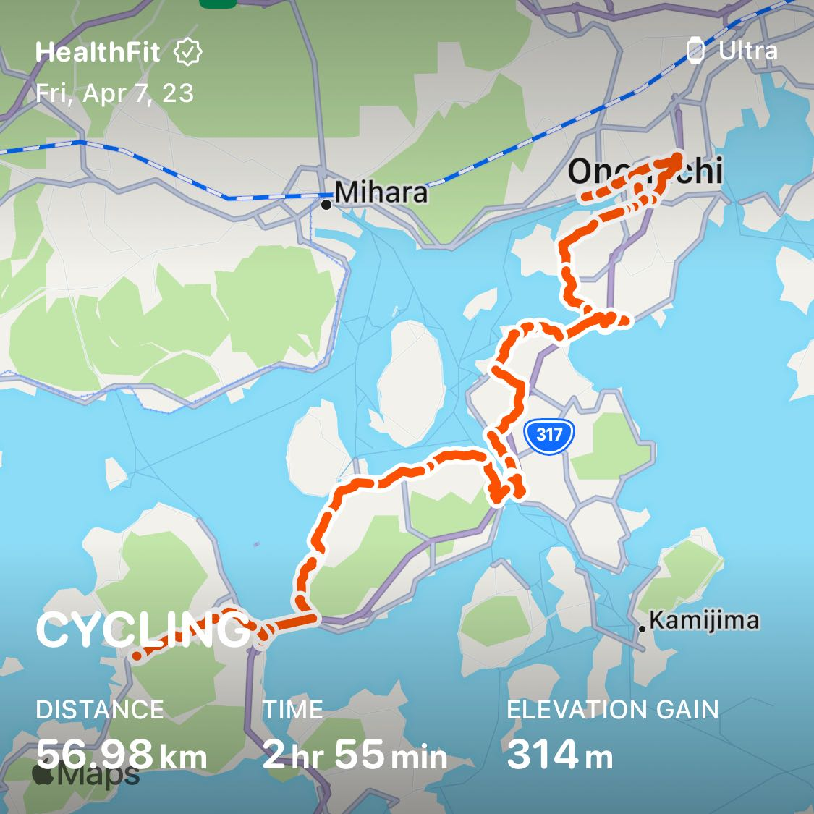

The first day started with getting our bearings - figuring out how to get *on* to the route (over a bridge we weren't sure we were allowed to ride) and subsequently how to *remain* on the route. The general idea is "follow the blue line on the road", but we soon learned that this line can arbitrarily stop in places you wish it didn't.

As a note, the normal way of getting on the route from onomichi is to take a short ferry trip, which I'd probably recommend as the more scenic and straightforward route.

Our first day was a long one, crossing three of the route's bridges and aiming to get to basically the only accommodation we could find with vacancies on the day. I may have forgotten to mention that it was our smart idea to wing accommodation for this part of the journey (surely there would be plenty right?!).

We managed to stay at a very cosy cafe/hostel which served some great beer, pizza, fish and chips and sour drinks mixed with the local citrus fruits. We consumed it all. The hostel owner (and chef for the night) may have forgotten our orders more than once, but the amazing food, drinks and vibe more than made up for it!

LINK TO ACCOMMODATION

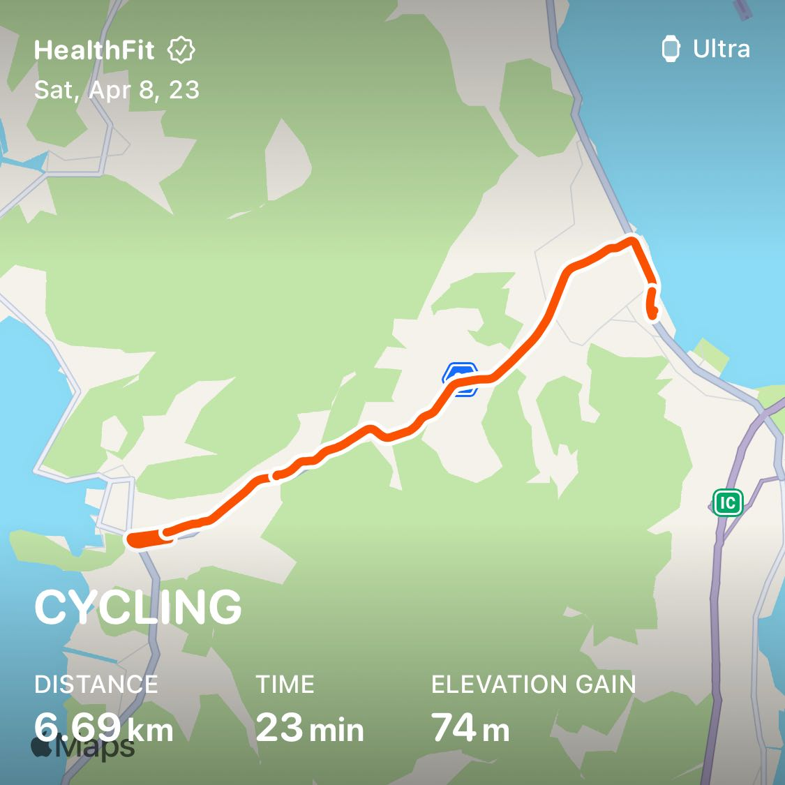

Our next morning started with the goal of finding somewhere that was open for breakfast. We found nowhere, so settled on a conbini (convenience store) breakfast. On the way out of the town, we did a final ride around to check out the area and came across a small yet homely winery. Thinking they might also have some kind of beer or snacks, we headed in but a single staff member informed us that they didn't really have much other than some bottles of wine for sale.

But in addition she told us that there was a special wine and beer event on only today, and only 6km away. Even better, it was on our route out of the area. How could we resist such an amazing temptation?!

As it turns out the event was being run at a local cycling organisation's camping grounds. We greeted the winery staff from the same winery that made us aware of the event, and then went on to definitely not drink every wine and beer on offering (a total of three different stalls) because we are responsible cyclists and that would take us over the legal blood-alcohol limit of 0.00% in Japan.

We did consume some very awesome jerk chicken.

We then set off – in very high spirits – for our next destination of Imabari.

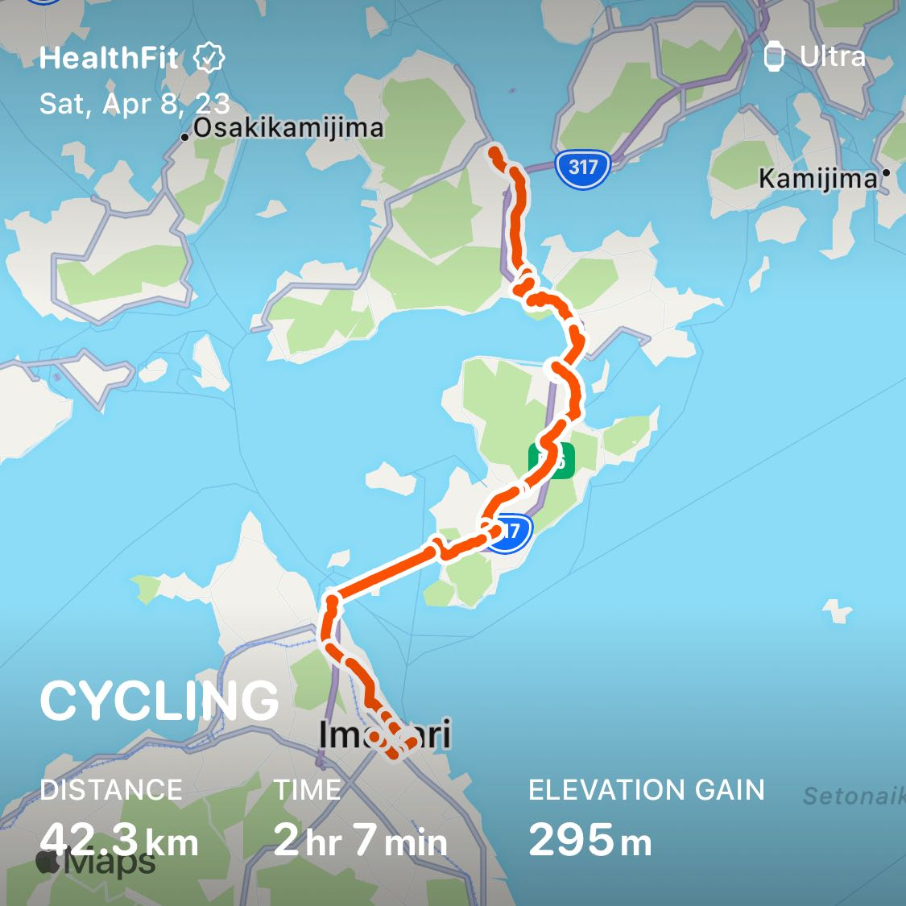

We managed to find a hotel which has rooms with built-in bike stands on the walls, very cool! Unfortunately all these rooms were taken, but as usual Japanese customer service (aka おもてなし) pulled through and the front desk setup some bicycle stands in the lobby especially for us. Well, for our bikes.

Imabari was one of the cycling "station"s on this route, and we made use of their pumping and washing facilities to give our bikes a bit of a clean-up after riding through semi-wet conditions the last couple of days.

TODO: mention tyre pressure

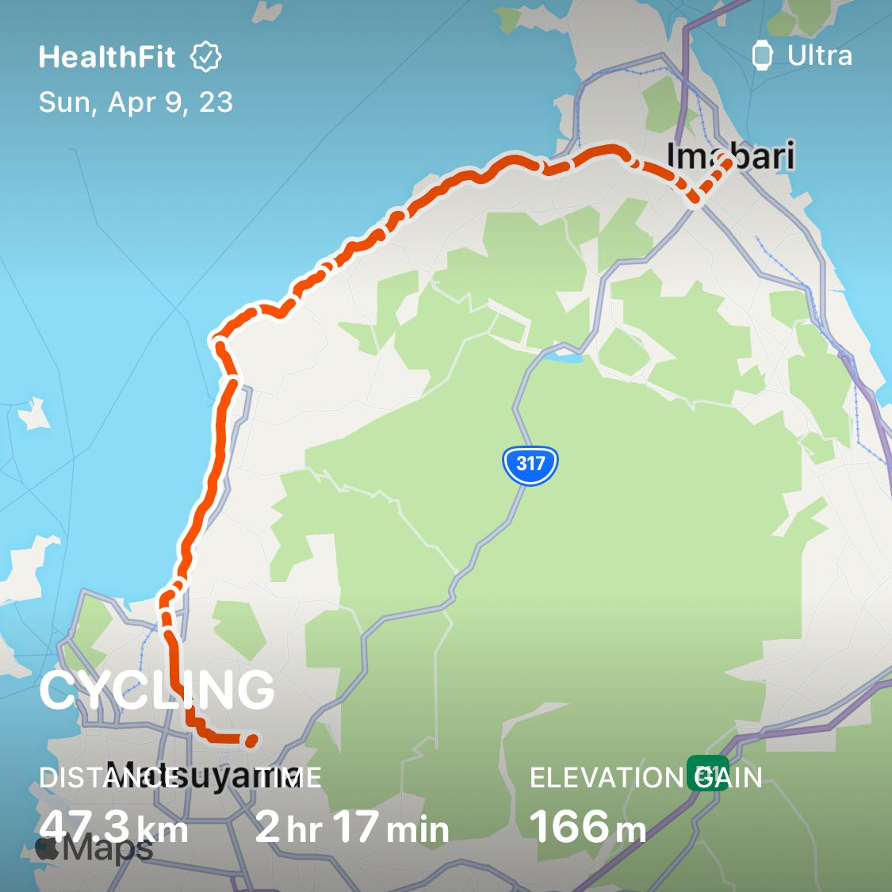

The day before when checking in at the hostel, the owner made small talk with us and it went something like "Ah, you're cycling the shimanami route! I guess you're heading to Dougo next?" to which we responded with a puzzled look and mentioned our next destination of Imabari.

Upon a bit of quick research, Dougo Onsen is a very historic onsen area which seems to be a must-stop. So of course, we planned a detour, lest we disrespect the Japanese cycling pilgrimage!

Dougo onsen was everything we imagined it to be. A small town with ice cream, beer and many people looking to take a bath. The main onsen building had a waitlist of around 2 hours, but the staff informed us there was a second building that recently opened, with the same "quality" water (as in it comes from the same fabled source) but no wait time.

We didn't really have two hours to spare as we wanted some time to make it the remaining distance to our next destination before night hit, so opted to locate the second, much more colourful but less ancient-looking onsen.

And oh boy was it worth it. There's nothing quite like hitting a hot spring and taking a moment to relax and reflect on the journey before continuing on.

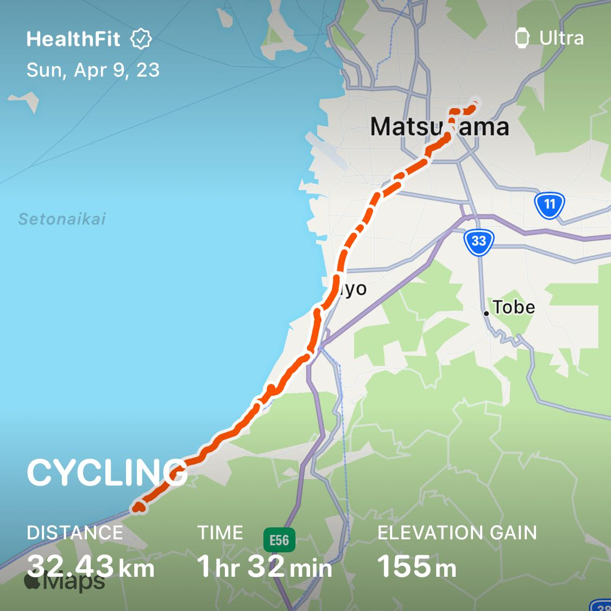

Our accommodation tonight was an Airbnb on the coastline, in the middle of nowhere. It was a huge looking house that most definitely was inherited or bought for the specific purpose of renting it out.

They mentioned in the description that it was possible to use a disposable BBQ set in the garden area, so we made a stop along the way at a supermarket to buy enough vegetables and meat to replenish our energy.

Oh, and beer.

The ride along the coast during golden hour and leading into sunset was absolutely magnificent.

Then the sun dropped and the chilly evening air hit, bringing us to our senses. This was definitely not outdoor barbecue weather.

We arrived at the accommodation, the last 5 minutes of the ride being up an insanely steep hill to get there. We were worn out and this is the last thing we needed, but at least it warmed us up a bit.

On arriving, the sight of this amazing traditional Japanese house with its own rock garden and sea views made the effort probably worth it.

We didn't really bring much cold weather clothing as we were trying to travel light, so layered on as many layers as we could to make this evening work.

The barbecue happened. It was pretty great but also pretty cold. Without beer it likely wouldn't have been anywhere near as bearable.

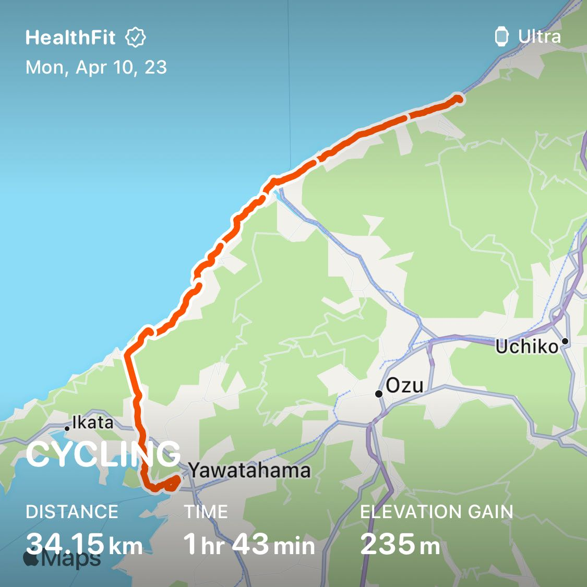

Final day of Shimanami, and we were on the clock, with a ferry booked and still 34 km to travel. We set out as early as we could and powered through.

This final segment was quite memorable for the four odd tunnels that we had to traverse – up to 1 km each. You could tell when one was coming up because the elevation graph on our GPS went from being bumpy mountainous terrain to suddenly completely straight and flat.

In the tunnels we could pick up some great speed, but we were also riding alongside cars and trucks in a confined space. And tunnel acoustics mean you get hit with the car noise ten-fold as it arrives from every direction, echoing off all the walls.

We made the ferry with around 30 minutes to spare and prepared for boarding alongside some bikers. It was a pretty great experience seeing the ferry workers securing our bikes to dedicated road bike mounts, and then leaving them for the main cabin.

We enjoyed a bento box for lunch, with more than one craft cider featuring citrus from the local area.

Dunny was exhausted and went to our private room to catch some sleep. I went to the lounge area and caught up on what work I could manage in the short 2 hour trip to Beppu.

What we had waiting for us at beppu was (arguably) our most luxurious accommodation of the trip – an intentionally timed choice to give us our best chance at recovery before what was to come. Hint: mountains, many mountains.

## Yamanami Highway (やまなみハイウェイ)

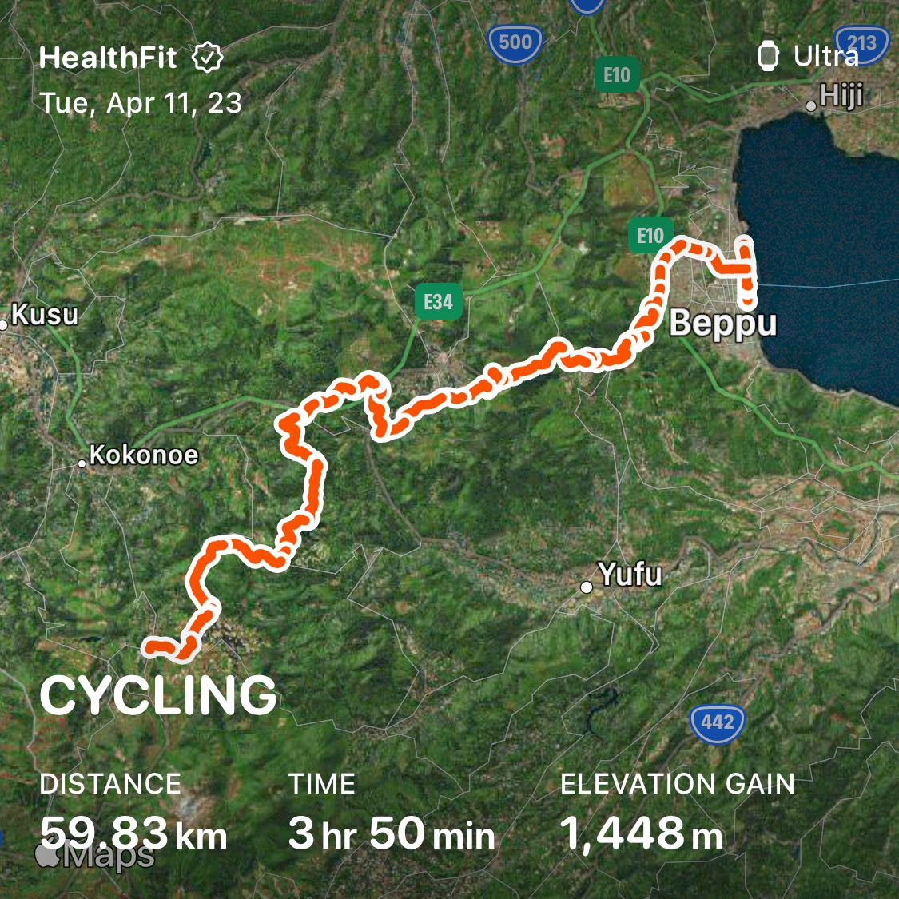

This was the pinnacle of pain in this trip. So far we were averaging 1-300 metres of elevation change a day, but the first part of this route saw us climbing 1,450 metres! Our destination was a tiny bed and breakfast hostel run by some of my not-blood-related Japanese family. This couple used to run a bikers house, but have since moved and now run this cute little accommodation alongside a curry restaurant.

The hilly terrain just never stopped, and kept going up as if there was no end. We would turn the next corner and there would be a new mountain to climb right in front of our eyes. We passed a cable car the went up most the way, and honestly if they allowed bikes on we may have been tempted to take it!

There was one section where we had to go downhill around 250 metres after climbing 900 up. I pulled over less than halfway through just to make sure we weren't going the wrong way and undoing all the work we did! Luckily, it was all part of the route.

As the sun began to set and we were still quite far from our destination, I made a courtesy phone call letting them know we would be a bit later than expected and were still gruelling away on the road. From the chuckling over the line, I could tell that I must have conveyed the exhaustion level we were experienced quite well.

This was one of the first opportunities to use the bluetooth speaker I brought along to jam to some tunes. It definitely helped keep us energised and motivated to keep on keeping on.

Within kilometres of our destination, we happened upon a small stable(?) with goats and other animals. There was one middle-aged man who ran up to us and we chatted about our trip and about the local area. Friendly locals are always a blast. Japanese people seem to be more willing to engage in conversation than in the larger cities. Though I guess that’s likely not a trait specific to Japan but more to do with living in the country.

Down the final slope, there was a group of school kids waiting at the end of the road. They gave us the most welcoming wave and greeting!

INSERT VIDEO OF APPROACHING

We ate not just one curries, but two! It was likely the most satisfying curry to eat.

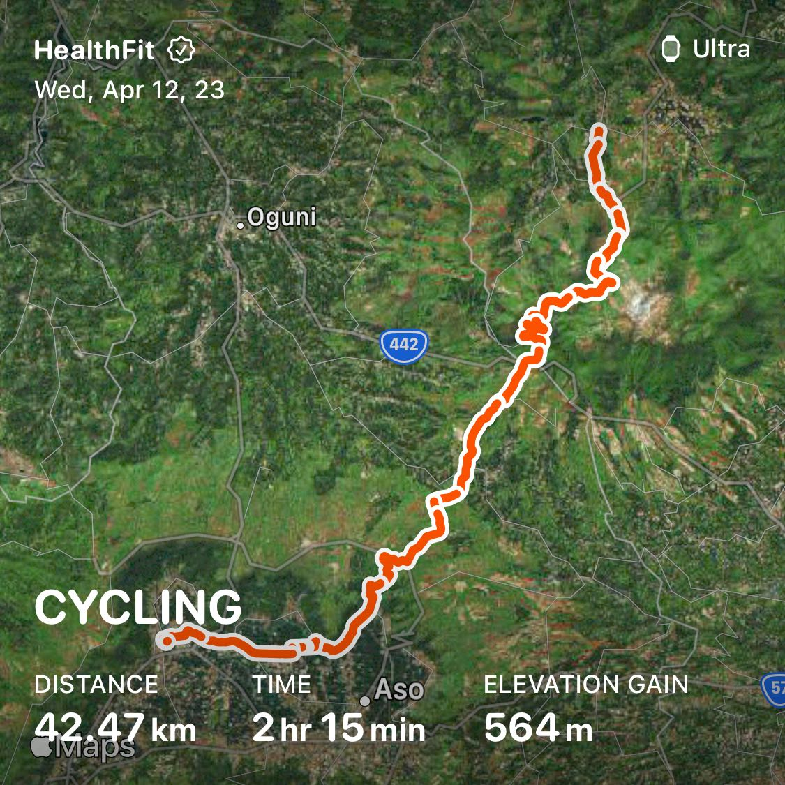

This wasn't the end of our uphill segment, though. Nowhere near as bad as the previous day, but still a challenge.

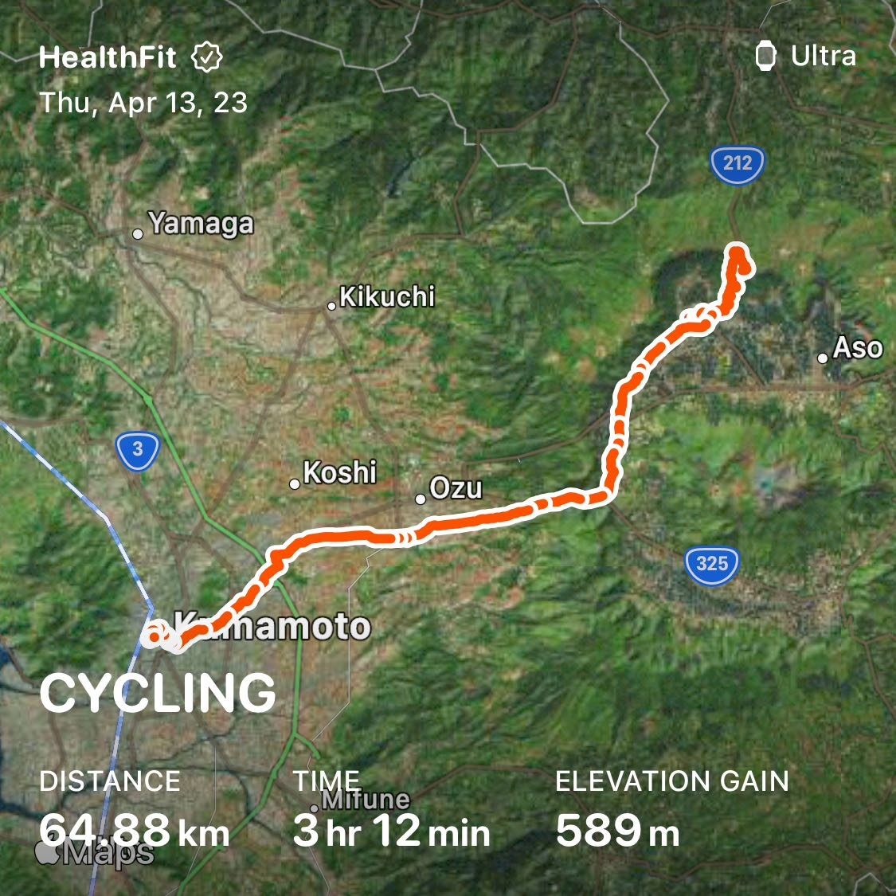

We set out to visit the peak of an area known as kusasenri, which gives an amazing panoramic view of the grassy flats around volcanic mountain Aso.

While we were recovering and taking in the sights, we ran into a pro biking team, who had done the whole route we took one-and-a-half-days to cover in one morning. It was amusing to see them on super-light bikes with no bags next to us, with four panniers probably weighing more than all of their bikes put together!

Felt like we were doing something wrong.

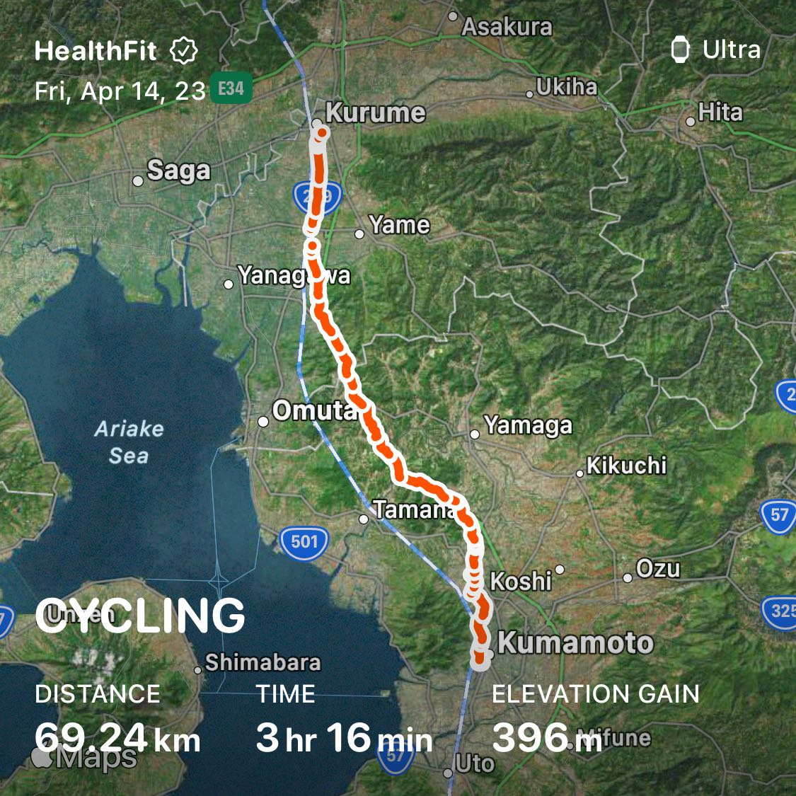

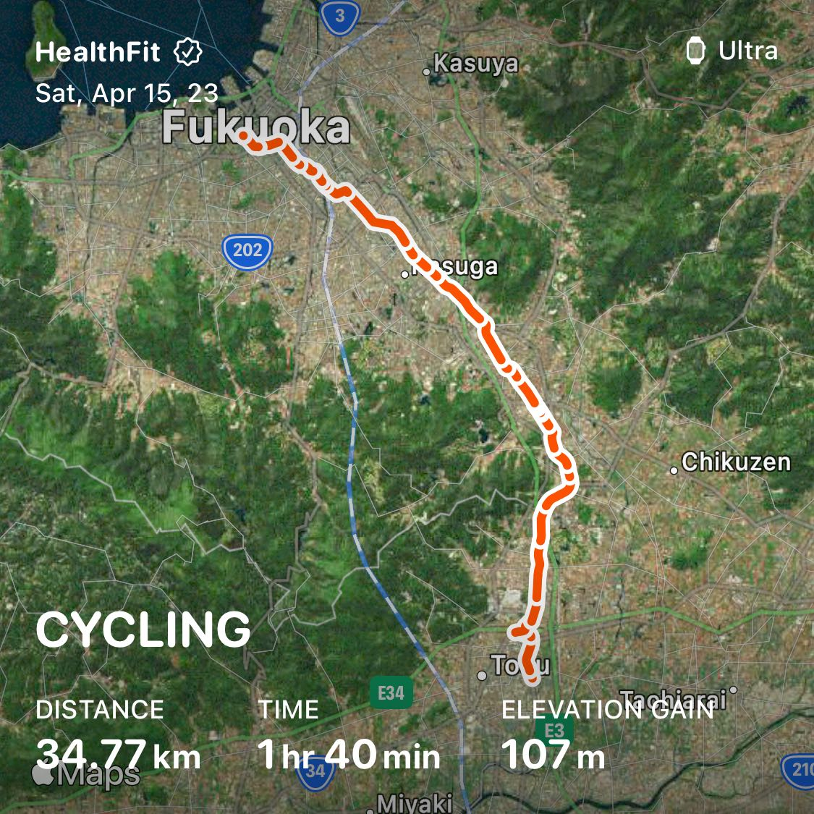<!-- {"width":865} -->

TODO: mention hakata stay?

## Biwaichi (琵琶湖一周)

After a few days parting our ways and catching up with friends and family in Hakata, we reconvened at Hakata station and bagged our bikes, back on a Shinkanens destined for Hikone (a castle town near Biwa lake).

This was to be our starting point for circling around the lake itself. After a short ride from our shinkansen station, we spent a night at a ryokan overlooking the castle. We ate teppanyaki (photos?) and were lucky enough to be the only people in the restaurant so had the full attention of the chef. He was a very cool guy.

The next day, we set off early in the morning to make it as far around the lake as we could.
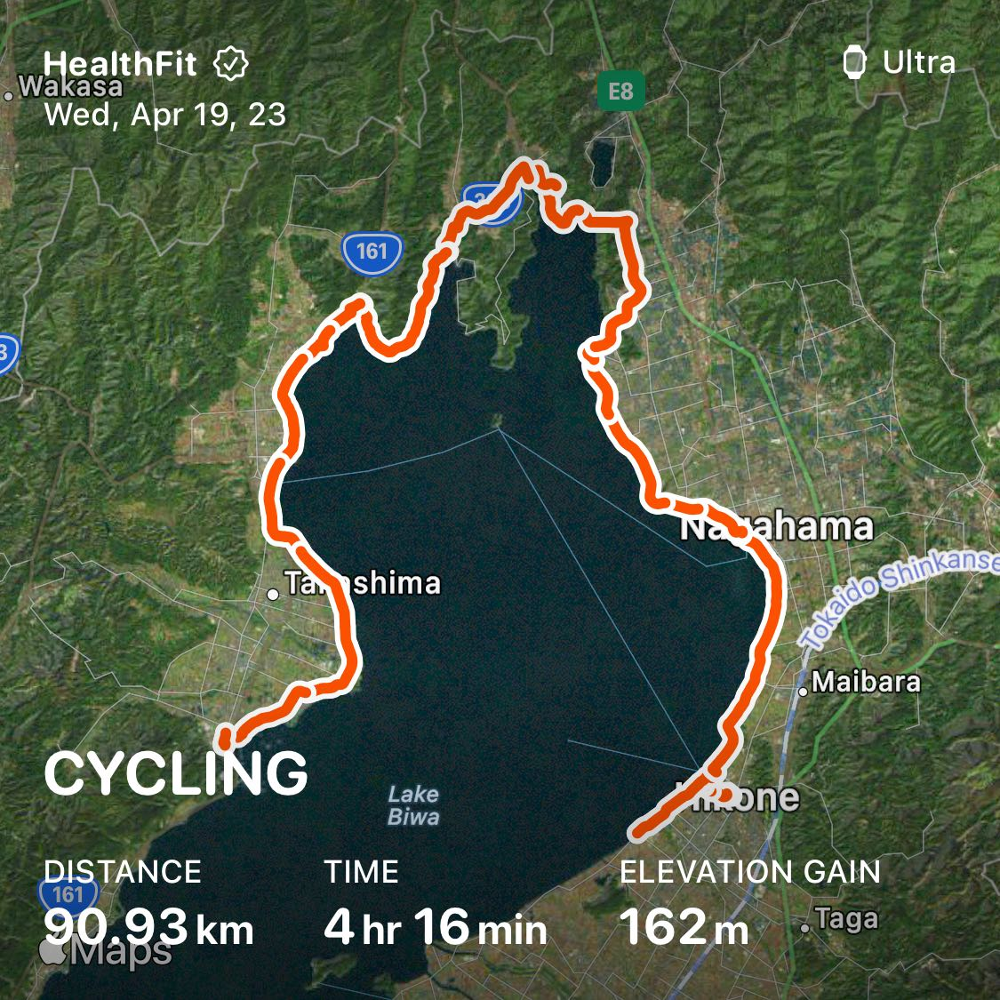

After an initial hiccup where we rode 6 km before realising we *were going the wrong way around the lake* (spot it on the map), it was smooth progress. Very little elevation change, but a lot of distance.. and bugs.

90 km in one day was a new record for us. My legs definitely felt it. There’s also something to be said about the scenery around the lake changing very slowly, and the fact you can basically see your destination on the other side of the lake (through some very heavy mist!) that made it less of an amazing scenic experience than our previous routes.

Nevertheless it had its great moments. We stopped at a rest house for lunch (and so I could participate in the bi-weekly osu! dev meeting). We also found a little house / shop that was selling craft teas and ginger biscuits. We bought biscuits intending to take them back as souvenirs for friends but ended up eating a good portion!

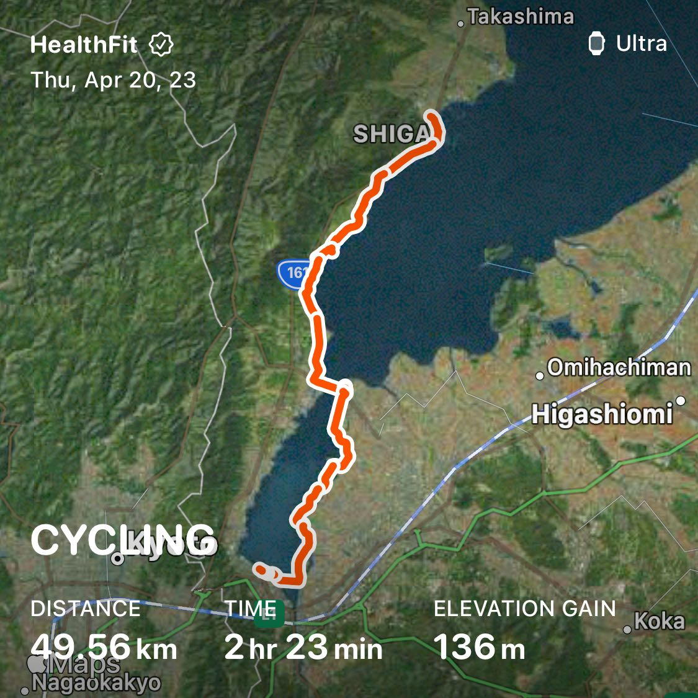

You may have noticed we didn’t actually do a full rotation. That’s because we wanted to set ourselves up best we could for the next day.
## To Osaka (京都→大阪)

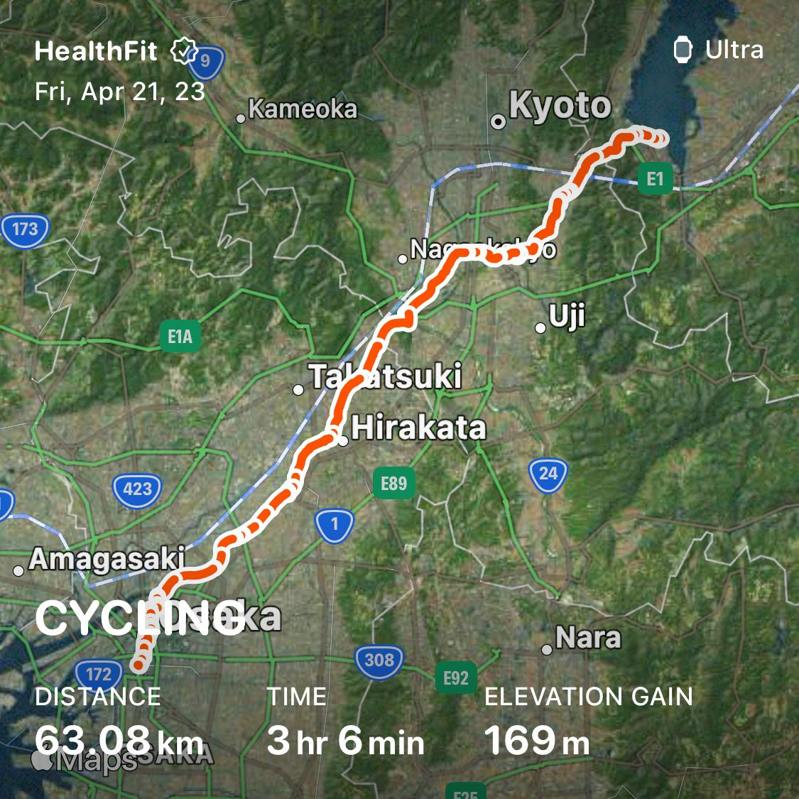

For USJ.

## To Himeji (大阪→姫路)

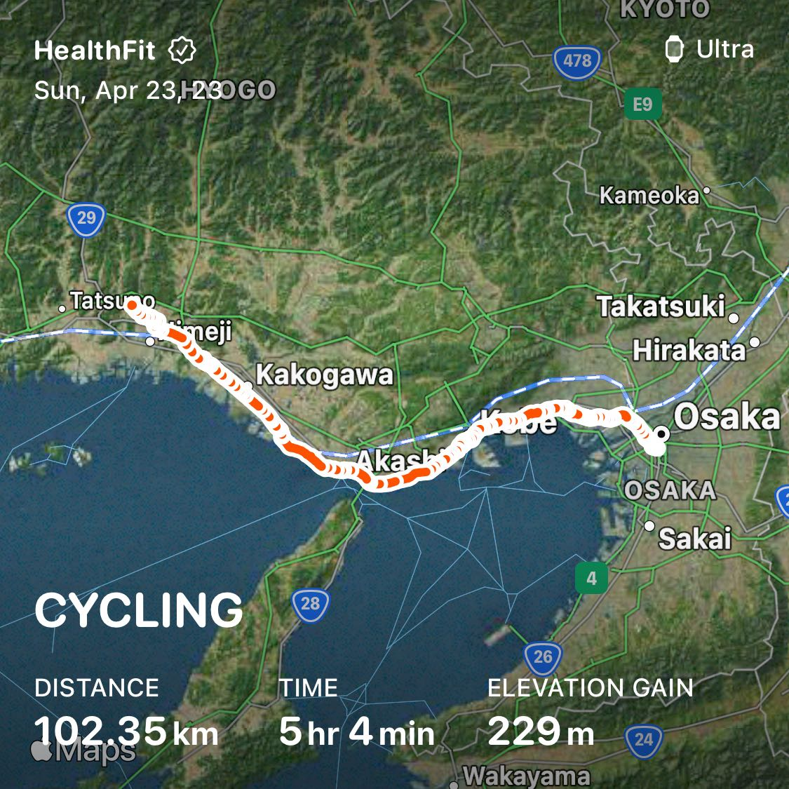

This was a bit of a bonus round. The original plan was to catch a train but after the previous efforts, we were much more confident at this stage we could make a final 110km push and avoid the hassle of bicycle disassembly.

TODO: check why biwako is missing a portion

All in all, we ended up covering a good portion of western and southern Japan. Would have loved to fill in the gaps, but we were already pushing both our fitness limits and time constraints!

---

Society, technology and everything around us is changing faster than ever. Most of the social discourse and news that is propagated is negative, uncomfortable and sometimes just outright scary. You may call it coping, but I make the personal choice not to follow world events and stay as uninformed as possible. It keeps me sane.

Call it luck or call it genes, I've never felt anything like burnout, stress or depression.

With that said, during covid due to lack of social interactions I optimised my life to allow me to be the most efficient dev I could be. My productivity skyrocketed, but in that time my fitness dropped significantly, and while I was still very happy, life became a touch mundane.

This cycling journey reinforced that witnessing and interacting with people in smaller towns and of different cultures, living their lives with completely different perspectives and outlooks on life to your own is eye-opening for sure.

Interacting with people and experiencing what nature has to offer is invigorating. Pushing yourself beyond the limits you thought your body had is painful but rewarding.

If you're not in the best place mentally, maybe it's time to do something crazy like cycling in one direction as far as you can. It might help set you straight just a bit.

---

Were you expecting an update on osu! development? I'm sorry to disappoint. The ongoing development on lazer is going great, although we've had setbacks with both available developers and dealing with the insanely complex requirements of each and every user.

In hindsight, trying to address almost every problem users had at once wasn't a good goalpost to set. And maybe the yearn to keep all game and scoring history intact and roughly balanced with a newer system is a stupid waste of time.

But I will continue plodding along in a forward direction that I hope will end in something that old and new players can respect.

If you want to know more about the development process, we've basically shifted to a [video changelog](https://www.youtube.com/playlist?list=PLmWVQsxi34bMTmgpDArfxJ32Q0mBLhcE-) style, with around two update videos a month. It's really fun and probably easier to digest than text anyway!
